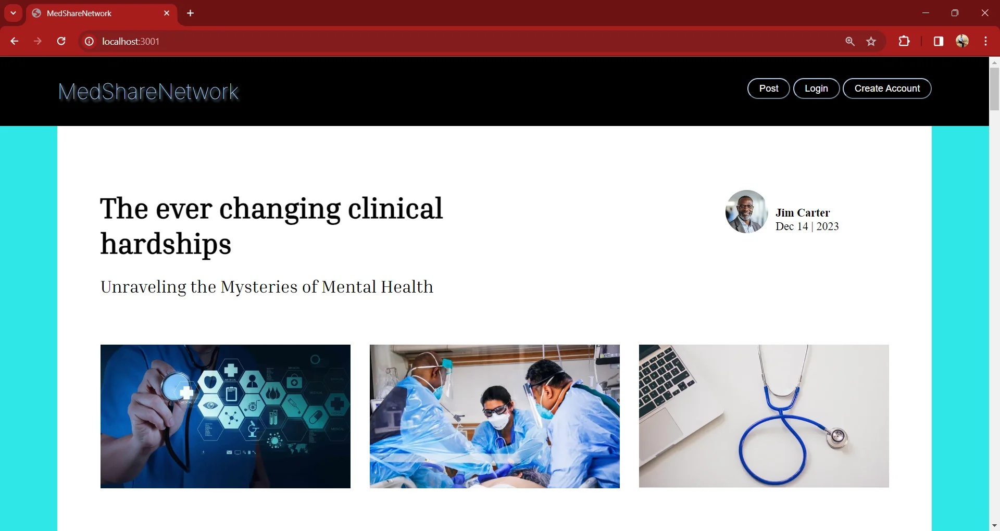

# MedShareNetwork

## Description
MedShareNetwork is a purpose-driven app addressing limited community healthcare engagement. By seamlessly connecting the medical community, providing a space for professionals and learners to chat, our platform ensures impactful contributions and meaningful collaboration. Join us in fostering a more connected and empowered healthcare community.

## Questions
- What was our motivation? MedShareNetwork was motivated by a belief in the power of small acts to create positive change in healthcare.

- Why did we build this project? We built this project to connect eager volunteers with healthcare organizations, fostering a purposeful and connected community.

- What problem does MedShareNetwork solve? MedShareNetwork solves the problem of limited community engagement in healthcare by providing a seamless platform for volunteers.

- What did we learn? 
Through this project, we realized that even small efforts can bring about meaningful change, highlighting the power and importance of collaboration in developing FullStack Applications.

## License
### Notice: MIT
[]
[MIT](https://opensource.org/licenses/MIT)

## Technologies Used
- JavaScript
- SQL
- Node.js
- CSS

## Packages Used
- bcrypt
- dotenv
- express
- express-handlebars
- express-session
- Sequelize

Deployed Site: https://medsharenetwork-3691a9c0e268.herokuapp.com/

GitHub: https://github.com/Batking74
